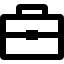
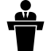
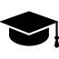

\pagenumbering{gobble}

##  Thales Alenia Space – Toulouse - 13 ans (2010-2023)

### Lead Craft & Architecte Logiciel - KVHTS/SpaceGate (2022 - ...)

*Télécommunication  & Réseau – Segment Sol Utilisateur*

* Mise en place de l'environnement de développement \
*Trustnest Digital Plateform (TDP), CI/CD, docAsCode, pipelines*
* Co-ingénierie système & architecture composant Link-Hub \
*C, Kubernetes, Docker, DPDK, netconf, gRPC*
* Formation de l'équipe de développement Link-Hub
* Analyse dette technique code legacy \
*MISRA, cyber, tests unitaires & d'intégrations, CodeSCene, Coverity*
* Développement d'un outil d'automatisation de traçabilité et de couverture\
*Rust, doors (CSV), RobotFramework, pipelines gitlab*

### Lead DevOps/Craft - LightSpeed/OBSW (2021)
*Logiciel embarqué – Segment Spatial*

* Mise en place de l'environnement de développement \
*TrustNest Digital Platform (TDP), Microsoft Azure*
* Définition et dévelopement de pipelines CI/CD \
*gitlab, docker, bash, asciidoc, sonarQube, Coverity, Jfrog Artifactory*
* Accompagnement BDD (Behavior Driven Development) et automatisation \
*Gherkin, Cucumber, Jira Xray*

### Support transverse méthodes & outils - CCSE/S3 (2020)

*Logiciel embarqué – Segment Spatial*

* Coaching DevOps pour différents projets
* Développement de pipelines et d'outils \
*git, Jenkins, groovy, compilation croisée, C, bash, Conan, Artifactory*
* Tradeoff outils de tests unitaires \
*IBM RTRT, VectorCast, Unity*
* Contribution à la définition d'un standard de règles de codage C commmun TAS JV

### Lead DevOps - SpaceGate (2019)

*Télécommunication – Segment Sol Utilisateur*

* Amélioration & Automatisation de la génération du Hub SpaceGate
* Responsable gestion de version sources logicielles du service
* Responsable Technique de l’équipe d’intégration logicielle\
*Git, Docker, Jenkins Pipeline, RobotFramework, SonarQube, Artifactory*

### Technical Leader & Product Owner - SpaceGate (2016-2018)

*Télécommunication – Segment Sol Utilisateur*

* Support à la mise en place de l’agilité (scrum, tests automatiques, workflow git)
* Gestion Backlog & Rédaction de User Stories
* Développement logiciel : architecture, gestion dette technique & code legacy\
*Scrum, Jira, Git, C, Python, Bash, Centos 6 x86, Asciidoc, OpenStack, 0mq*

### Architecte Logiciel - SpaceGate (2015)

*Télécommunication – Segment Sol Utilisateur*

* Support à l’ingénierie système
* Architecture et Spécification de l’organe de management du Hub
* Mise en place d’un plateau de développement logiciel externalisé

### Développeur logiciel & Tech Lead - DVB R2 (2011-2014)

*Télécommunication – Segment Sol Utilisateur*

* Développement d’un Modem de télécommunication aéro. S2/S2
* Développement d’un proxy web services vers SNMP
* Evolution du protocole d’encapsulation dans le Hub & le Modem DVB S2
* Développement & maintenance du modem DVBS2/RCS\
*Fedora, Debian, Bash, Git, C, RESTful Web Services, JSON, SNMP*

##  Viveris Technologies - Toulouse  - 3 ans (oct. 2007 – Déc. 2010)

### Développeur logiciel
* Développement d'un PEP (Performance-Enhancing Proxy) TCP/HTTP serveur & client
* Evolutions et maintenance logicielle du terminal de télécommunication\
*Fedora, Debian, Bash, Git, C, cmake, Perl, CVS, TCP, DVB-S2, DVB-RCS*

---

##  Coaching & Mentoring

### Animateur de la Communauté Software Craftsmanship - 3 ans (2020 à aujourd'hui)
* Création de la communauté de pratiques TAS-F
* Sensibilisation Craft
* Organisation de meetups \
*TDD, Clean code, refactoring, code review, Redis*
* Organisation de Coding Dojos
* Présentations et ateliers autour du DocAsCode \
*Antora, asciidoc, markdown, plantUML, excalidraw*
* Rédaction du chapitre Craft inclus dans le mémento d'ingénierie logicielle TAS

###  Tuteur de Stage "Rust embarqué" - 6 mois (mars 2022 - septembre 2022)
* Préparation environnement de développement Rust
* Présentation du langage
* Coding Dojo sur les notions "Ownership/Borrowing" de Rust
* Documentation & comparaisons avec le langage C

##  Formations
* Meetup **Rust Thales/ECE** Paris (Juillet 2023)
* Conférence **NewCrafts** Toulouse 2019\
*Conférence autour du développement logiciels pour les développeurs pour qui la qualité du code est non négociable*
* Certification **SAFe® 4 Agilist** – 2019
* Formation **Scaled Agile Framework** (SAFe), Thierry Cros organisation (2019)
* Formation Agile for **Product Owner**, Thales université (2017)
* Formation Passeport **Lean and Co Engineering**, Thales Université (2016)
* Conférence **FOSDEM** 2015, Bruxelles 2015\
*Free and Open Source Software Developers' European Meeting*
* Diplôme d’**ingénieur en Télécommunication & Réseaux**, ENSEEIHT, Toulouse (2004-2007)
